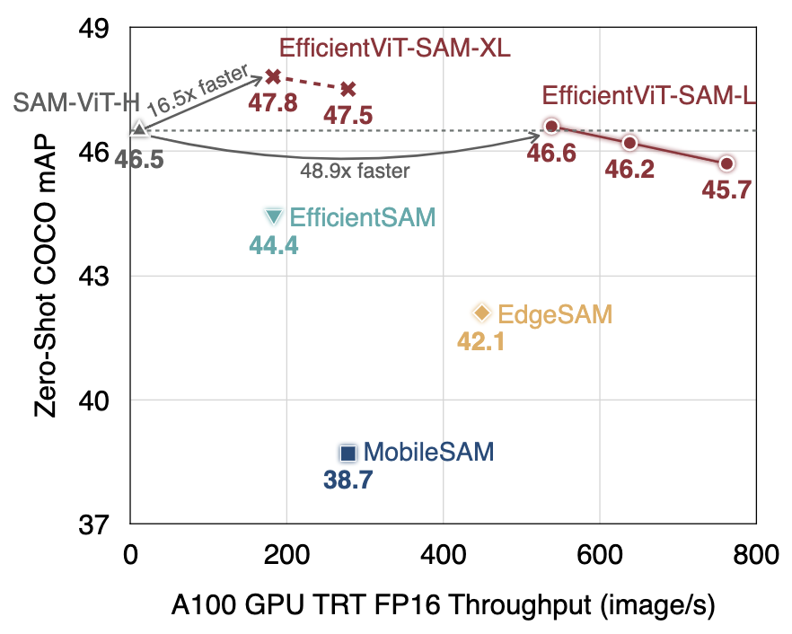

# EfficientViT: Multi-Scale Linear Attention for High-Resolution Dense Prediction ([paper](https://arxiv.org/abs/2205.14756), [poster](assets/files/efficientvit_poster.pdf))

## News

**If you are interested in getting updates, please join our mailing list [here](https://forms.gle/Z6DNkRidJ1ouxmUk9).**

- [2024/03/19] Online demo of EfficientViT-SAM is available: [https://evitsam.hanlab.ai/](https://evitsam.hanlab.ai/). 
- [2024/02/08] Tech report of EfficientViT-SAM is available: [arxiv](https://arxiv.org/abs/2402.05008).
- [2024/02/07] We released EfficientViT-SAM, the first accelerated SAM model that matches/outperforms SAM-ViT-H's zero-shot performance, delivering the SOTA performance-efficiency trade-off.
- [2023/11/20] EfficientViT is available in the [NVIDIA Jetson Generative AI Lab](https://www.jetson-ai-lab.com/tutorial_efficientvit.html).
- [2023/09/12] EfficientViT is highlighted by [MIT home page](https://www.mit.edu/archive/spotlight/efficient-computer-vision/) and [MIT News](https://news.mit.edu/2023/ai-model-high-resolution-computer-vision-0912).
- [2023/07/18] EfficientViT is accepted by ICCV 2023.

## About EfficientViT Models

EfficientViT is a new family of ViT models for efficient high-resolution dense prediction vision tasks. The core building block of EfficientViT is a lightweight, multi-scale linear attention module that achieves global receptive field and multi-scale learning with only hardware-efficient operations, making EfficientViT TensorRT-friendly and suitable for GPU deployment.

## Third-Party Implementation/Integration

- [NVIDIA Jetson Generative AI Lab](https://www.jetson-ai-lab.com/tutorial_efficientvit.html)
- [timm](https://github.com/huggingface/pytorch-image-models): [link](https://github.com/huggingface/pytorch-image-models/blob/main/timm/models/efficientvit_mit.py)
- [X-AnyLabeling](https://github.com/CVHub520/X-AnyLabeling): [link](https://github.com/CVHub520/X-AnyLabeling/blob/main/anylabeling/services/auto_labeling/efficientvit_sam.py)

## Getting Started

```bash
conda create -n efficientvit python=3.10
conda activate efficientvit
conda install -c conda-forge mpi4py openmpi
pip install -r requirements.txt
```

## EfficientViT Applications

### [Segment Anything](applications/sam.md)
- [Datasets](applications/sam.md#datasets)
- [Pretrained Models](applications/sam.md#pretrained-models)
- [Use in Pytorch](applications/sam.md#usage)
- [Evaluation](applications/sam.md#evaluation)
- [Visualization](applications/sam.md#visualization)
- [Web Demo](demo/sam/README.md)
- [Deployment using ONNX and TensorRT](applications/sam.md#deployment)

<p align="left">

</p>

| Model         |  Resolution | COCO mAP | LVIS mAP | Params |  MACs | Jetson Orin Latency (bs1) | A100 Throughput (bs16) | Checkpoint |
|----------------------|:----------:|:----------:|:---------:|:------------:|:---------:|:---------:|:------------:|:------------:|
| EfficientViT-SAM-L0 | 512x512 | 45.7 | 41.8 | 34.8M  | 35G | 8.2ms  | 762 images/s | [link](https://huggingface.co/han-cai/efficientvit-sam/resolve/main/l0.pt) |
| EfficientViT-SAM-L1 | 512x512 | 46.2 | 42.1 | 47.7M | 49G |  10.2ms | 638 images/s | [link](https://huggingface.co/han-cai/efficientvit-sam/resolve/main/l1.pt) |
| EfficientViT-SAM-L2 | 512x512 | 46.6 | 42.7 | 61.3M | 69G |  12.9ms | 538 images/s  | [link](https://huggingface.co/han-cai/efficientvit-sam/resolve/main/l2.pt) |
| EfficientViT-SAM-XL0 | 1024x1024 | 47.5 | 43.9 | 117.0M | 185G | 22.5ms  | 278 images/s | [link](https://huggingface.co/han-cai/efficientvit-sam/resolve/main/xl0.pt) |
| EfficientViT-SAM-XL1 | 1024x1024 | 47.8 | 44.4 | 203.3M | 322G | 37.2ms  | 182 images/s | [link](https://huggingface.co/han-cai/efficientvit-sam/resolve/main/xl1.pt) |
<p align="center">
<b> Table1: Summary of All EfficientViT-SAM Variants.</b> COCO mAP and LVIS mAP are measured using ViTDet's predicted bounding boxes as the prompt. End-to-end Jetson Orin latency and A100 throughput are measured with TensorRT and fp16.
</p>


### [Image Classification](applications/cls.md)
- [Datasets](applications/cls.md#datasets)
- [Pretrained Models](applications/cls.md#pretrained-models)
- [Use in Pytorch](applications/cls.md#usage)
- [Evaluation](applications/cls.md#evaluation)
- [Deployment](applications/cls.md#export)
- [Training](applications/cls.md#training)

<p align="left">

</p>

### [Semantic Segmentation](applications/seg.md)
- [Datasets](applications/seg.md#datasets)
- [Pretrained Models](applications/seg.md#pretrained-models)
- [Use in Pytorch](applications/seg.md#usage)
- [Evaluation](applications/seg.md#evaluation)
- [Visualization](applications/seg.md#visualization)
- [Deployment](applications/seg.md#export)


## Contact

Han Cai: <hancai@mit.edu>

## TODO

- [x] ImageNet Pretrained models
- [x] Segmentation Pretrained models
- [x] ImageNet training code
- [x] EfficientViT L series, designed for cloud
- [x] EfficientViT for segment anything
- [ ] EfficientViT for image generation
- [ ] EfficientViT for CLIP
- [ ] EfficientViT for super-resolution
- [ ] Segmentation training code

## Citation

If EfficientViT is useful or relevant to your research, please kindly recognize our contributions by citing our paper:

```
@article{cai2022efficientvit,
  title={Efficientvit: Enhanced linear attention for high-resolution low-computation visual recognition},
  author={Cai, Han and Gan, Chuang and Han, Song},
  journal={arXiv preprint arXiv:2205.14756},
  year={2022}
}
```
