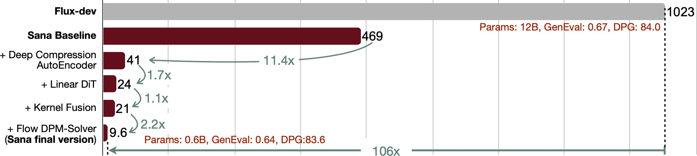

# EfficientViT: Multi-Scale Linear Attention for High-Resolution Dense Prediction [[paper](https://arxiv.org/abs/2205.14756)]

**Efficient vision foundation models for high-resolution generation and perception.**

## Content

### Deep Compression Autoencoder for Efficient High-Resolution Diffusion Models [[paper](https://arxiv.org/abs/2410.10733)] [[readme](applications/dc_ae/README.md)]

**Deep Compression Autoencoder (DC-AE) is a new family of high-spatial compression autoencoders with a spatial compression ratio of up to 128 while maintaining reconstruction quality. It accelerates all latent diffusion models regardless of the diffusion model architecture.**


<p align="center">
<b> Figure 1: We address the reconstruction accuracy drop of high spatial-compression autoencoders.
</p>


<p align="center">
<b> Figure 2: DC-AE speeds up latent diffusion models.
</p>

<p align="left">

</p>

<p align="center">

</p>

<p align="center">
<b> Figure 3: DC-AE enables efficient text-to-image generation on the laptop. For more details, please check our text-to-image diffusion model <a href="https://nvlabs.github.io/Sana/">SANA</a>.
</p>

- [Usage of Deep Compression Autoencoder](applications/dc_ae/README.md#deep-compression-autoencoder)
- [Usage of DC-AE-Diffusion](applications/dc_ae/README.md#efficient-diffusion-models-with-dc-ae)
- [Evaluate Deep Compression Autoencoder](applications/dc_ae/README.md#evaluate-deep-compression-autoencoder)
- [Demo DC-AE-Diffusion Models](applications/dc_ae/README.md#demo-dc-ae-diffusion-models)
- [Evaluate DC-AE-Diffusion Models](applications/dc_ae/README.md#evaluate-dc-ae-diffusion-models)
- [Train DC-AE-Diffusion Models](applications/dc_ae/README.md#train-dc-ae-diffusion-models)
- [Reference](applications/dc_ae/README.md#reference)

### EfficientViT-SAM: Accelerated Segment Anything Model Without Accuracy Loss [[paper](https://arxiv.org/abs/2402.05008)] [[online demo](https://evitsam.hanlab.ai/)] [[readme](applications/efficientvit_sam/README.md)]

**EfficientViT-SAM is a new family of accelerated segment anything models by replacing SAM's heavy image encoder with EfficientViT. It delivers a 48.9x measured TensorRT speedup on A100 GPU over SAM-ViT-H without sacrificing accuracy.**

<p align="left">

</p>

- [Pretrained EfficientViT-SAM Models](applications/efficientvit_sam/README.md#pretrained-efficientvit-sam-models)
- [Usage of EfficientViT-SAM](applications/efficientvit_sam/README.md#usage)
- [Evaluate EfficientViT-SAM](applications/efficientvit_sam/README.md#evaluation)
- [Visualize EfficientViT-SAM](applications/efficientvit_sam/README.md#visualization)
- [Deploy EfficientViT-SAM](applications/efficientvit_sam/README.md#deployment)
- [Train EfficientViT-SAM](applications/efficientvit_sam/README.md#training)
- [Reference](applications/efficientvit_sam/README.md#reference)

### EfficientViT-Classification [[paper](https://arxiv.org/abs/2205.14756)] [[readme](applications/efficientvit_cls/README.md)]

**Efficient image classification models with EfficientViT backbones.**

<p align="left">

</p>

- [Pretrained EfficientViT Classification Models](applications/efficientvit_cls/README.md#pretrained-efficientvit-classification-models)
- [Usage of EfficientViT Classification Models](applications/efficientvit_cls/README.md#usage)
- [Evaluate EfficientViT Classification Models](applications/efficientvit_cls/README.md#evaluation)
- [Export EfficientViT Classification Models](applications/efficientvit_cls/README.md#export)
- [Train EfficientViT Classification Models](applications/efficientvit_cls/README.md#training)
- [Reference](applications/efficientvit_cls/README.md#reference)

### EfficientViT-Segmentation [[paper](https://arxiv.org/abs/2205.14756)] [[readme](applications/efficientvit_seg/README.md)]

**Efficient semantic segmantation models with EfficientViT backbones.**


- [Pretrained EfficientViT Segmentation Models](applications/efficientvit_seg/README.md#pretrained-efficientvit-segmentation-models)
- [Usage of EfficientViT Segmentation Models](applications/efficientvit_seg/README.md#usage)
- [Evaluate EfficientViT Segmentation Models](applications/efficientvit_seg/README.md#evaluation)
- [Visualize EfficientViT Segmentation Models](applications/efficientvit_seg/README.md#visualization)
- [Export EfficientViT Segmentation Models](applications/efficientvit_seg/README.md#export)
- [Reference](applications/efficientvit_seg/README.md#reference)

### EfficientViT-GazeSAM [[readme](applications/efficientvit_gazesam/README.md)]

**Gaze-prompted image segmentation models capable of running in real time with TensorRT on an NVIDIA RTX 4070.**


## News

**If you are interested in getting updates, please join our mailing list [here](https://forms.gle/Z6DNkRidJ1ouxmUk9).**

- [2024/10/21] DC-AE and EfficientViT block are used in our latest text-to-image diffusion model SANA! Check the [project page](https://nvlabs.github.io/Sana/) for more details.
- [2024/10/15] We released **Deep Compression Autoencoder (DC-AE)**: [link](#deep-compression-autoencoder-for-efficient-high-resolution-diffusion-models-paper-readme)!
- [2024/07/10] EfficientViT is used as the backbone in [Grounding DINO 1.5 Edge](https://arxiv.org/pdf/2405.10300) for efficient open-set object detection.
- [2024/07/10] EfficientViT-SAM is used in [MedficientSAM](https://github.com/hieplpvip/medficientsam), the 1st place model in [CVPR 2024 Segment Anything In Medical Images On Laptop Challenge](https://www.codabench.org/competitions/1847/).
- [2024/07/10] An FPGA-based accelerator for EfficientViT: [link](https://arxiv.org/abs/2403.20230).
- [2024/04/23] We released the training code of EfficientViT-SAM.
- [2024/04/06] EfficientViT-SAM is accepted by [eLVM@CVPR'24](https://sites.google.com/view/elvm/home?authuser=0).
- [2024/03/19] Online demo of EfficientViT-SAM is available: [https://evitsam.hanlab.ai/](https://evitsam.hanlab.ai/). 
- [2024/02/07] We released [EfficientViT-SAM](https://arxiv.org/abs/2402.05008), the first accelerated SAM model that matches/outperforms SAM-ViT-H's zero-shot performance, delivering the SOTA performance-efficiency trade-off.
- [2023/11/20] EfficientViT is available in the [NVIDIA Jetson Generative AI Lab](https://www.jetson-ai-lab.com/tutorial_efficientvit.html).
- [2023/09/12] EfficientViT is highlighted by [MIT home page](https://www.mit.edu/archive/spotlight/efficient-computer-vision/) and [MIT News](https://news.mit.edu/2023/ai-model-high-resolution-computer-vision-0912).
- [2023/07/18] EfficientViT is accepted by ICCV 2023.

## Getting Started

```bash
conda create -n efficientvit python=3.10
conda activate efficientvit
pip install -r requirements.txt
```

## Third-Party Implementation/Integration

- [NVIDIA Jetson Generative AI Lab](https://www.jetson-ai-lab.com/tutorial_efficientvit.html)
- [timm](https://github.com/huggingface/pytorch-image-models): [link](https://github.com/huggingface/pytorch-image-models/blob/main/timm/models/efficientvit_mit.py)
- [X-AnyLabeling](https://github.com/CVHub520/X-AnyLabeling): [link](https://github.com/CVHub520/X-AnyLabeling/blob/main/anylabeling/services/auto_labeling/efficientvit_sam.py)
- [Grounding DINO 1.5 Edge](https://github.com/IDEA-Research/Grounding-DINO-1.5-API): [link](https://arxiv.org/pdf/2405.10300)

## Contact

[Han Cai](http://hancai.ai/)

## Reference

If EfficientViT or EfficientViT-SAM or DC-AE is useful or relevant to your research, please kindly recognize our contributions by citing our paper:

```bibtex
@inproceedings{cai2023efficientvit,
  title={Efficientvit: Lightweight multi-scale attention for high-resolution dense prediction},
  author={Cai, Han and Li, Junyan and Hu, Muyan and Gan, Chuang and Han, Song},
  booktitle={Proceedings of the IEEE/CVF International Conference on Computer Vision},
  pages={17302--17313},
  year={2023}
}
```

```bibtex
@article{zhang2024efficientvit,
  title={EfficientViT-SAM: Accelerated Segment Anything Model Without Performance Loss},
  author={Zhang, Zhuoyang and Cai, Han and Han, Song},
  journal={arXiv preprint arXiv:2402.05008},
  year={2024}
}
```

```bibtex
@article{chen2024deep,
  title={Deep Compression Autoencoder for Efficient High-Resolution Diffusion Models},
  author={Chen, Junyu and Cai, Han and Chen, Junsong and Xie, Enze and Yang, Shang and Tang, Haotian and Li, Muyang and Lu, Yao and Han, Song},
  journal={arXiv preprint arXiv:2410.10733},
  year={2024}
}
```
