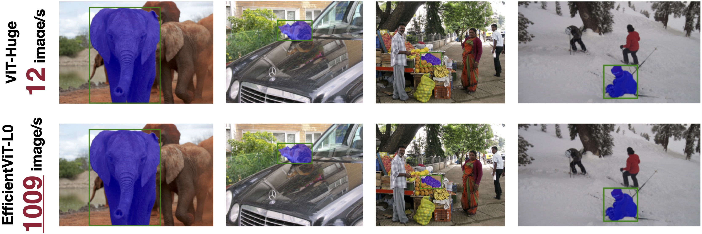
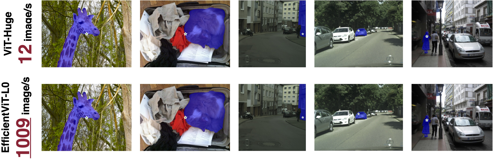
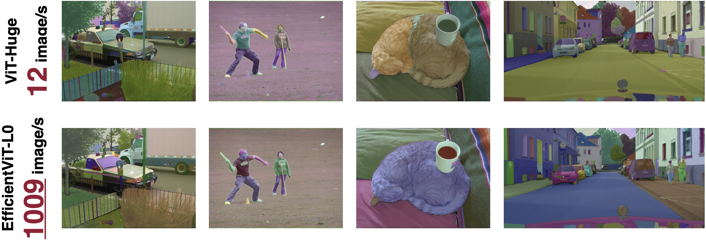

# EfficientViT: Multi-Scale Linear Attention for High-Resolution Dense Prediction ([paper](https://arxiv.org/abs/2205.14756), [poster](assets/files/efficientvit_poster.pdf))

## News

**If you are interested in getting updates, please join our mailing list [here](https://forms.gle/Z6DNkRidJ1ouxmUk9).**

- [2023/11/20] EfficientViT is available in the [NVIDIA Jetson Generative AI Lab](https://www.jetson-ai-lab.com/tutorial_efficientvit.html).
- [2023/11/20] We will soon release the second version of EfficientViT SAM models. Preview of the new version:

| Image Encoder | A100 Throughput |Zero-Shot LVIS mIoU (all) | Zero-Shot COCO-val2017 mIoU (all) | 
|----------------------|:----------:|:----------:|:---------:|
| [SAM-ViT-H](https://github.com/facebookresearch/segment-anything)  |  12 image/s | 75.4 | 77.4 |
| EfficientViT-L0-SAM-v2 | 1009 image/s | 76.3 | 77.1 | 

- [2023/10/22] ImageNet training scripts for the EfficientViT L series have been released.
- [2023/09/18] **EfficientViT for Segment Anything Model (SAM)** is released. EfficientViT SAM runs at 1009 images/s on A100 GPU, compared to ViT-H (12 images/s), mobileSAM (297 images/s), and nanoSAM (744 image/s, but much lower mIoU)
- [2023/09/12] EfficientViT is highlighted by [MIT home page](https://www.mit.edu/archive/spotlight/efficient-computer-vision/) and [MIT News](https://news.mit.edu/2023/ai-model-high-resolution-computer-vision-0912).
- [2023/07/18] EfficientViT is accepted by ICCV 2023.

## Demo

EfficientViT-L0 for Segment Anything (1009 image/s on A100 GPU)




EfficientViT-L1 for Semantic Segmentation (45.9ms on Nvidia Jetson AGX Orin, 82.716 mIoU on Cityscapes)


## About EfficientViT Models

EfficientViT is a new family of ViT models for efficient high-resolution dense prediction vision tasks. The core building block of EfficientViT is a lightweight, multi-scale linear attention module that achieves global receptive field and multi-scale learning with only hardware-efficient operations, making EfficientViT TensorRT-friendly and suitable for GPU deployment.

## Third-Party Implementation/Integration

- [NVIDIA Jetson Generative AI Lab](https://www.jetson-ai-lab.com/tutorial_efficientvit.html)
- [timm](https://github.com/huggingface/pytorch-image-models): [link](https://github.com/huggingface/pytorch-image-models/blob/main/timm/models/efficientvit_mit.py)
- [X-AnyLabeling](https://github.com/CVHub520/X-AnyLabeling): [link](https://github.com/CVHub520/X-AnyLabeling/blob/main/anylabeling/services/auto_labeling/efficientvit_sam.py)

## Getting Started

### Installation

```bash
conda create -n efficientvit python=3.10
conda activate efficientvit
conda install -c conda-forge mpi4py openmpi
pip install -r requirements.txt
```

### Dataset

<details>
  <summary>ImageNet: https://www.image-net.org/</summary>

  ```python
  Our code expects the ImageNet dataset directory to follow the following structure:

  imagenet
  ├── train
  ├── val
  ```

</details>

<details>
  <summary>Cityscapes: https://www.cityscapes-dataset.com/</summary>

  ```python
  Our code expects the Cityscapes dataset directory to follow the following structure:

  cityscapes
  ├── gtFine
  |   ├── train
  |   ├── val
  ├── leftImg8bit
  |   ├── train
  |   ├── val
  ```

</details>

<details>
  <summary>ADE20K: https://groups.csail.mit.edu/vision/datasets/ADE20K/</summary>

  ```python
  Our code expects the ADE20K dataset directory to follow the following structure:

  ade20k
  ├── annotations
  |   ├── training
  |   ├── validation
  ├── images
  |   ├── training
  |   ├── validation
  ```
  
</details>

## Pretrained Models

Latency/Throughput is measured on NVIDIA Jetson Nano, NVIDIA Jetson AGX Orin, and NVIDIA A100 GPU with TensorRT, fp16. Data transfer time is included.

### Segment Anything

In this version, the EfficientViT segment anything models are trained using the image embedding extracted by [SAM ViT-H](https://github.com/facebookresearch/segment-anything) as the target. The prompt encoder and mask decoder are the same as [SAM ViT-H](https://github.com/facebookresearch/segment-anything).

| Image Encoder  | COCO-val2017 mIoU (all) | COCO-val2017 mIoU (large) | COCO-val2017 mIoU (medium) | COCO-val2017 mIoU (small) | Params |  MACs | A100 Throughput | Checkpoint |
|----------------------|:----------:|:----------:|:---------:|:------------:|:---------:|:---------:|:------------:|:------------:|
| NanoSAM  | [70.6](https://github.com/NVIDIA-AI-IOT/nanosam#%EF%B8%8F-performance) | 79.6 | 73.8 | 62.4 | - | - | 744 image/s | - |
| MobileSAM | [72.8](https://github.com/NVIDIA-AI-IOT/nanosam#%EF%B8%8F-performance) | 80.4 | 75.9 | 65.8 | - | - | 297 image/s | - |
||
| EfficientViT-L0-SAM | 74.454 | 81.410 | 77.201 | 68.159 | 31M | 35G | 1009 image/s | [link](https://drive.google.com/file/d/1AiaX67kT-TX5yr0wOZn51jICj-k5aBmx/view?usp=sharing) |
| EfficientViT-L1-SAM | 75.183 | 81.786 | 78.110 | 68.944 | 44M | 49G | 815 image/s | [link](https://drive.google.com/file/d/1ji6NcDfZF8b2kkFn9DolnbaOGSqklECe/view?usp=sharing) |
| EfficientViT-L2-SAM | 75.656 | 81.706 | 78.644 | 69.689 | 57M | 69G | 634 image/s | [link](https://huggingface.co/han-cai/efficientvit-sam/blob/main/l2.pt) |

### ImageNet

All EfficientViT classification models are trained on ImageNet-1K with random initialization (300 epochs + 20 warmup epochs) using supervised learning.

<p align="left">

</p>

| Model         |  Resolution | ImageNet Top1 Acc | ImageNet Top5 Acc |  Params |  MACs |  A100 Throughput | Checkpoint |
|----------------------|:----------:|:----------:|:---------:|:------------:|:---------:|:------------:|:------------:|
| EfficientNetV2-S | 384x384 | [83.9](https://github.com/google/automl/tree/master/efficientnetv2#2-pretrained-efficientnetv2-checkpoints) | - | 22M | 8.4G | 2869 image/s | - |
| EfficientNetV2-M | 480x480 | [85.2](https://github.com/google/automl/tree/master/efficientnetv2#2-pretrained-efficientnetv2-checkpoints) | - | 54M | 25G | 1160 image/s | - |
| |
| EfficientViT-L1 | 224x224 |  84.484 | 96.862 | 53M | 5.3G | 6207 image/s | [link](https://drive.google.com/file/d/1q5y0YbN08O4ToUBK8RfZSDKp-s1y5_44/view?usp=sharing) |
| |
| EfficientViT-L2 | 224x224 |  85.050 | 97.090 | 64M | 6.9G | 4998 image/s | [link](https://drive.google.com/file/d/1FEjImtyIQhG4VsHsstLgNM09Y9qJn9Sk/view?usp=sharing) |
| EfficientViT-L2 | 256x256 |  85.366 | 97.216 | 64M | 9.1G | 3969 image/s | [link](https://drive.google.com/file/d/1pvYtY0ckAAMTkRq6TbwpQ0U1p_urz2fE/view?usp=sharing) |
| EfficientViT-L2 | 288x288 |  85.630 | 97.364 | 64M | 11G  | 3102 image/s | [link](https://drive.google.com/file/d/1GDr0y45YPX8iWEWNq5fEmjo0UgyZLpUs/view?usp=sharing) |
| EfficientViT-L2 | 320x320 |  85.734 | 97.438 | 64M | 14G  | 2525 image/s | [link](https://drive.google.com/file/d/1GDr0y45YPX8iWEWNq5fEmjo0UgyZLpUs/view?usp=sharing) |
| EfficientViT-L2 | 384x384 |  85.978 | 97.518 | 64M | 20G  | 1784 image/s | [link](https://drive.google.com/file/d/1MpjduiCTbUVS1XJri4_eqCbARJyYo74b/view?usp=sharing) |
| |
| EfficientViT-L3 | 224x224 | 85.814 | 97.198 | 246M | 28G | 2081 image/s | [link](https://huggingface.co/han-cai/efficientvit-imagenet/blob/main/l3-r224.pt) |
| EfficientViT-L3 | 256x256 | 85.938 | 97.318 | 246M | 36G | 1641 image/s | [link](https://huggingface.co/han-cai/efficientvit-imagenet/blob/main/l3-r256.pt) |
| EfficientViT-L3 | 288x288 | 86.070 | 97.440 | 246M | 46G | 1276 image/s | [link](https://huggingface.co/han-cai/efficientvit-imagenet/blob/main/l3-r288.pt) |
| EfficientViT-L3 | 320x320 | 86.230 | 97.474 | 246M | 56G | 1049 image/s | [link](https://huggingface.co/han-cai/efficientvit-imagenet/blob/main/l3-r320.pt) |
| EfficientViT-L3 | 384x384 | 86.408 | 97.632 | 246M | 81G | 724 image/s | [link](https://huggingface.co/han-cai/efficientvit-imagenet/blob/main/l3-r384.pt) |

<details>
  <summary>EfficientViT B series</summary>

  | Model         |  Resolution | ImageNet Top1 Acc | ImageNet Top5 Acc |  Params |  MACs |  Jetson Nano (bs1) | Jetson Orin (bs1) | Checkpoint |
  |----------------------|:----------:|:----------:|:---------:|:------------:|:---------:|:------------:|:------------:|:------------:|
  | EfficientViT-B1 | 224x224 | 79.390 | 94.346 | 9.1M | 0.52G | 24.8ms | 1.48ms | [link](https://drive.google.com/file/d/1hKN_hvLG4nmRzbfzKY7GlqwpR5uKpOOk/view?usp=share_link) |
  | EfficientViT-B1 | 256x256 | 79.918 | 94.704 | 9.1M | 0.68G | 28.5ms | 1.57ms | [link](https://drive.google.com/file/d/1hXcG_jB0ODMOESsSkzVye-58B4F3Cahs/view?usp=share_link) |
  | EfficientViT-B1 | 288x288 | 80.410 | 94.984 | 9.1M | 0.86G | 34.5ms | 1.82ms | [link](https://drive.google.com/file/d/1sE_Suz9gOOUO7o5r9eeAT4nKK8Hrbhsu/view?usp=share_link) |
  | |
  | EfficientViT-B2 | 224x224 | 82.100 | 95.782 | 24M  | 1.6G  | 50.6ms | 2.63ms | [link](https://drive.google.com/file/d/1DiM-iqVGTrq4te8mefHl3e1c12u4qR7d/view?usp=share_link) |
  | EfficientViT-B2 | 256x256 | 82.698 | 96.096 | 24M  | 2.1G  | 58.5ms | 2.84ms | [link](https://drive.google.com/file/d/192OOk4ISitwlyW979M-FSJ_fYMMW9HQz/view?usp=share_link) |
  | EfficientViT-B2 | 288x288 | 83.086 | 96.302 | 24M  | 2.6G  | 69.9ms | 3.30ms | [link](https://drive.google.com/file/d/1aodcepOyne667hvBAGpf9nDwmd5g0NpU/view?usp=share_link) |
  | |
  | EfficientViT-B3 | 224x224 | 83.468 | 96.356 | 49M  | 4.0G  | 101ms  | 4.36ms | [link](https://drive.google.com/file/d/18RZDGLiY8KsyJ7LGic4mg1JHwd-a_ky6/view?usp=share_link) |
  | EfficientViT-B3 | 256x256 | 83.806 | 96.514 | 49M  | 5.2G  | 120ms  | 4.74ms | [link](https://drive.google.com/file/d/1y1rnir4I0XiId-oTCcHhs7jqnrHGFi-g/view?usp=share_link) |
  | EfficientViT-B3 | 288x288 | 84.150 | 96.732 | 49M  | 6.5G  | 141ms  | 5.63ms | [link](https://drive.google.com/file/d/1KfwbGtlyFgslNr4LIHERv6aCfkItEvRk/view?usp=share_link) |
</details>

### Cityscapes

<p align="left">

</p>

| Model         |  Resolution | Cityscapes mIoU | Params |  MACs |  Jetson Orin Latency (bs1) | A100 Throughput (bs1) | Checkpoint |
|----------------------|:----------:|:----------:|:---------:|:------------:|:---------:|:---------:|:------------:|
| EfficientViT-L1 | 1024x2048 | 82.716 | 40M | 282G | 45.9ms  | 122 image/s | [link](https://drive.google.com/file/d/1iiy-LHpGIutXbPV-tJThAtz6jAgNcuxX/view?usp=sharing) |
| EfficientViT-L2 | 1024x2048 | 83.228 | 53M | 396G | 60.0ms  | 102 image/s | [link](https://drive.google.com/file/d/1U7Ryk0Iha8r00MK2hsYx88-PKJTmvSCR/view?usp=sharing) |

<details>
  <summary>EfficientViT B series</summary>

  | Model         |  Resolution | Cityscapes mIoU | Params |  MACs |  Jetson Nano (bs1) | Jetson Orin (bs1) | Checkpoint |
  |----------------------|:----------:|:----------:|:---------:|:------------:|:---------:|:---------:|:------------:|
  | EfficientViT-B0 | 1024x2048 | 75.653 | 0.7M | 4.4G | 275ms  | 9.9ms  | [link](https://drive.google.com/file/d/1Ix1Dh3xlpaf0Wzh01Xmo-hAYkoXt1EAD/view?usp=sharing) |
  | EfficientViT-B1 | 1024x2048 | 80.547 | 4.8M | 25G  | 819ms  | 24.3ms | [link](https://drive.google.com/file/d/1jNjLFtIUNvu5MwSupgFHLc-2kmFLiu67/view?usp=sharing) |
  | EfficientViT-B2 | 1024x2048 | 82.073 | 15M  | 74G  | 1676ms | 46.5ms | [link](https://drive.google.com/file/d/1bwGjzVQOg_ygML8F9JhsIj-ntn-cuWmB/view?usp=sharing) |
  | EfficientViT-B3 | 1024x2048 | 83.016 | 40M  | 179G | 3192ms | 81.8ms | [link](https://drive.google.com/file/d/19aiy3qrKqx1n8zzy_ewYn4-Z3LM4bkn4/view?usp=sharing) |

</details>

### ADE20K

<p align="left">

</p>

| Model         |  Resolution | ADE20K mIoU | Params |  MACs |  Jetson Orin Latency (bs1) | A100 Throughput (bs16) | Checkpoint |
|----------------------|:----------:|:----------:|:---------:|:------------:|:---------:|:---------:|:------------:|
| EfficientViT-L1 | 512x512 | 49.191 | 40M | 36G | 7.2ms  | 947 image/s | [link](https://drive.google.com/file/d/1ErosNnztXT3ncrppWWPEMp5pag5WE-Vy/view?usp=sharing) |
| EfficientViT-L2 | 512x512 | 50.702 | 51M | 45G | 9.0ms | 758 image/s | [link](https://drive.google.com/file/d/1UBEWNOqi6ks5h09Zoe6wWalUA8a2a7fi/view?usp=sharing) |

<details>
  <summary>EfficientViT B series</summary>

  | Model         |  Resolution | ADE20K mIoU | Params |  MACs |  Jetson Nano (bs1) | Jetson Orin (bs1) | Checkpoint |
  |----------------------|:----------:|:----------:|:---------:|:------------:|:---------:|:---------:|:------------:|
  | EfficientViT-B1 | 512x512 | 42.840 | 4.8M | 3.1G | 110ms | 4.0ms  | [link](https://drive.google.com/file/d/13YNtEJ-mRnAhu0fIs2EnAP-3TmSneRAC/view?usp=sharing) |
  | EfficientViT-B2 | 512x512 | 45.941 | 15M  | 9.1G | 212ms | 7.3ms  | [link](https://drive.google.com/file/d/1k5sWY6aJ1FCtMt4GRTZqSFlJ-u_TSHzc/view?usp=sharing) |
  | EfficientViT-B3 | 512x512 | 49.013 | 39M  | 22G  | 411ms | 12.5ms | [link](https://drive.google.com/file/d/1ghpTf9GTTj_8mn5QJh-7cLK1_wL3pKWr/view?usp=sharing) |

</details>

## Usage
```python
# segment anything
from efficientvit.sam_model_zoo import create_sam_model

efficientvit_sam = create_sam_model(
  name="l2", weight_url="assets/checkpoints/sam/l2.pt",
)
efficientvit_sam = efficientvit_sam.cuda().eval()
```

```python
from efficientvit.models.efficientvit.sam import EfficientViTSamPredictor

efficientvit_sam_predictor = EfficientViTSamPredictor(efficientvit_sam)
```

```python
from efficientvit.models.efficientvit.sam import EfficientViTSamAutomaticMaskGenerator

efficientvit_mask_generator = EfficientViTSamAutomaticMaskGenerator(efficientvit_sam)

```

```python
# classification
from efficientvit.cls_model_zoo import create_cls_model

model = create_cls_model(
  name="l3", weight_url="assets/checkpoints/cls/l3-r384.pt"
)
```

```python
# semantic segmentation
from efficientvit.seg_model_zoo import create_seg_model

model = create_seg_model(
  name="l2", dataset="cityscapes", weight_url="assets/checkpoints/seg/cityscapes/l2.pt"
)

model = create_seg_model(
  name="l2", dataset="ade20k", weight_url="assets/checkpoints/seg/ade20k/l2.pt"
)
```

## Evaluation

Please run `eval_sam_coco.py`, `eval_cls_model.py` or `eval_seg_model.py` to evaluate our models.

Examples: [segment anything](assets/files/eval_sam_model.sh), [classification](assets/files/eval_cls_model.sh), [segmentation](assets/files/eval_seg_model.sh)

## Visualization

Please run `demo_sam_model.py` to visualize our segment anything models.

Example:

```bash
# segment everything
python demo_sam_model.py --model l1 --mode all

# prompt with points
python demo_sam_model.py --model l1 --mode point

# prompt with box
python demo_sam_model.py --model l1 --mode box --box "[150,70,630,400]"

```

Please run `eval_seg_model.py` to visualize the outputs of our semantic segmentation models.

Example:

```bash
python eval_seg_model.py --dataset cityscapes --crop_size 1024 --model b3 --save_path demo/cityscapes/b3/
```

## Export TFLite

To generate TFLite files, please refer to `tflite_export.py`. It requires the TinyNN package.

```bash
pip install git+https://github.com/alibaba/TinyNeuralNetwork.git
```

Example:

```bash
python tflite_export.py --export_path model.tflite --task seg --dataset ade20k --model b3 --resolution 512 512
```

## Export ONNX

To generate ONNX files, please refer to `onnx_export.py`.

To export ONNX files for EfficientViT SAM models, please refer to the [scripts](https://github.com/CVHub520/efficientvit/tree/main#benchmarking-with-onnxruntime) shared by [CVHub](https://github.com/CVHub520).

## Training

Please see [TRAINING.md](TRAINING.md) for detailed training instructions.

## Contact

Han Cai: <hancai@mit.edu>

## TODO

- [x] ImageNet Pretrained models
- [x] Segmentation Pretrained models
- [x] ImageNet training code
- [x] EfficientViT L series, designed for cloud
- [x] EfficientViT for segment anything
- [ ] EfficientViT for image generation
- [ ] EfficientViT for super-resolution
- [ ] Segmentation training code

## Citation

If EfficientViT is useful or relevant to your research, please kindly recognize our contributions by citing our paper:

```
@article{cai2022efficientvit,
  title={Efficientvit: Enhanced linear attention for high-resolution low-computation visual recognition},
  author={Cai, Han and Gan, Chuang and Han, Song},
  journal={arXiv preprint arXiv:2205.14756},
  year={2022}
}
```
