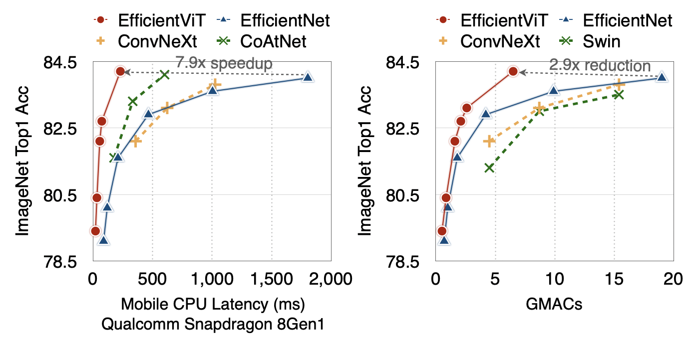

# EfficientViT: Multi-Scale Linear Attention for High-Resolution Dense Prediction

### [paper](https://arxiv.org/abs/2205.14756) | [poster](assets/efficientvit_files/poster.pdf)

## News
**If you are interested in getting updates, please join our mailing list [here](https://forms.gle/Z6DNkRidJ1ouxmUk9).**
- [2023/09/12] EfficientViT is highlighted by [MIT home page](https://www.mit.edu/archive/spotlight/efficient-computer-vision/) and [MIT News](https://news.mit.edu/2023/ai-model-high-resolution-computer-vision-0912).
- [2023/07/18] EfficientViT is accepted by ICCV 2023.

## Demo
EfficientViT-L1 (45.9ms on Nvidia Jetson AGX Orin, 82.7 mIoU on Cityscapes)


## About EfficientViT Models

EfficientViT is a new family of vision models for efficient high-resolution dense prediction. The core building block of EfficientViT is a new lightweight multi-scale linear attention module that achieves global receptive field and multi-scale learning with only hardware-efficient operations. 

Here are the results of EfficientViT on image classification:
<p align="left">

</p>

Here are comparisons with prior SOTA semantic segmentation models:
<p align="left">

</p>

## Getting Started

### Installation
```bash
conda create -n efficientvit python=3.10
conda activate efficientvit
conda install -c conda-forge mpi4py openmpi
pip install -r requirements.txt
```

### Dataset
- ImageNet: https://www.image-net.org/
```
Our code expects the ImageNet dataset directory to follow the following structure:

imagenet
├── train
├── val
```
- Cityscapes: https://www.cityscapes-dataset.com/
```
Our code expects the Cityscapes dataset directory to follow the following structure:

cityscapes
├── gtFine
|   ├── train
|   ├── val
├── leftImg8bit
|   ├── train
|   ├── val
```
- ADE20K: https://groups.csail.mit.edu/vision/datasets/ADE20K/
```
Our code expects the ADE20K dataset directory to follow the following structure:

ade20k
├── annotations
|   ├── training
|   ├── validation
├── images
|   ├── training
|   ├── validation
```

### Download Pretrained Models
Latency/Throughput is measured on NVIDIA Jetson Nano, NVIDIA Jetson AGX Orin, and NVIDIA A100 GPU with TensorRT, fp16. Data transfer time is included.

#### ImageNet
All EfficientViT classification models are trained on ImageNet-1K with random initialization (300 epochs + 20 warmup epochs) using supervised learning.

| Model         |  Resolution | ImageNet Top1 Acc | ImageNet Top5 Acc |  Params |  MACs |  A100 Throughput | Checkpoint |
|----------------------|:----------:|:----------:|:---------:|:------------:|:---------:|:------------:|:------------:|
| EfficientNetV2-S | 384x384 | 83.9 | - | 22M | 8.8G | 2869 image/s | - |
| EfficientNetV2-M | 480x480 | 85.1 | - | 54M | 24G | 1160 image/s | - |
| |
| EfficientViT-L1 | 224x224 |  84.5 | 96.9 | 53M | 5.3G | 6207 image/s | [link](https://drive.google.com/file/d/1q5y0YbN08O4ToUBK8RfZSDKp-s1y5_44/view?usp=sharing) |
| |
| EfficientViT-L2 | 224x224 |  85.0 | 97.1 | 64M | 6.9G | 4998 image/s | [link](https://drive.google.com/file/d/1FEjImtyIQhG4VsHsstLgNM09Y9qJn9Sk/view?usp=sharing) |
| EfficientViT-L2 | 256x256 |  85.4 | 97.2 | 64M | 9.1G | 3969 image/s | [link](https://drive.google.com/file/d/1pvYtY0ckAAMTkRq6TbwpQ0U1p_urz2fE/view?usp=sharing) |
| EfficientViT-L2 | 288x288 |  85.6 | 97.4 | 64M | 11G  | 3102 image/s | [link](https://drive.google.com/file/d/1GDr0y45YPX8iWEWNq5fEmjo0UgyZLpUs/view?usp=sharing) |
| EfficientViT-L2 | 320x320 |  85.8 | 97.4 | 64M | 14G  | 2525 image/s | [link](https://drive.google.com/file/d/1GDr0y45YPX8iWEWNq5fEmjo0UgyZLpUs/view?usp=sharing) |
| EfficientViT-L2 | 352x352 |  85.9 | 97.5 | 64M | 17G  | 2099 image/s | [link](https://drive.google.com/file/d/1gEkrj2JScJEcUgxeBSVKpUYBbple99yI/view?usp=sharing) |
| EfficientViT-L2 | 384x384 |  86.0 | 97.5 | 64M | 20G  | 1784 image/s | [link](https://drive.google.com/file/d/1MpjduiCTbUVS1XJri4_eqCbARJyYo74b/view?usp=sharing) |

| Model         |  Resolution | ImageNet Top1 Acc | ImageNet Top5 Acc |  Params |  MACs |  Jetson Nano (bs1) | Jetson Orin (bs1) | Checkpoint |
|----------------------|:----------:|:----------:|:---------:|:------------:|:---------:|:------------:|:------------:|:------------:|
| EfficientViT-B1 | 224x224 | 79.4 | 94.3 | 9.1M | 0.52G | 24.8ms | 1.48ms | [link](https://drive.google.com/file/d/1hKN_hvLG4nmRzbfzKY7GlqwpR5uKpOOk/view?usp=share_link) |
| EfficientViT-B1 | 256x256 | 79.9 | 94.7 | 9.1M | 0.68G | 28.5ms | 1.57ms | [link](https://drive.google.com/file/d/1hXcG_jB0ODMOESsSkzVye-58B4F3Cahs/view?usp=share_link) |
| EfficientViT-B1 | 288x288 | 80.4 | 95.0 | 9.1M | 0.86G | 34.5ms | 1.82ms | [link](https://drive.google.com/file/d/1sE_Suz9gOOUO7o5r9eeAT4nKK8Hrbhsu/view?usp=share_link) |
| |
| EfficientViT-B2 | 224x224 | 82.1 | 95.8 | 24M  | 1.6G  | 50.6ms | 2.63ms | [link](https://drive.google.com/file/d/1DiM-iqVGTrq4te8mefHl3e1c12u4qR7d/view?usp=share_link) |
| EfficientViT-B2 | 256x256 | 82.7 | 96.1 | 24M  | 2.1G  | 58.5ms | 2.84ms | [link](https://drive.google.com/file/d/192OOk4ISitwlyW979M-FSJ_fYMMW9HQz/view?usp=share_link) |
| EfficientViT-B2 | 288x288 | 83.1 | 96.3 | 24M  | 2.6G  | 69.9ms | 3.30ms | [link](https://drive.google.com/file/d/1aodcepOyne667hvBAGpf9nDwmd5g0NpU/view?usp=share_link) |
| |
| EfficientViT-B3 | 224x224 | 83.5 | 96.4 | 49M  | 4.0G  | 101ms  | 4.36ms | [link](https://drive.google.com/file/d/18RZDGLiY8KsyJ7LGic4mg1JHwd-a_ky6/view?usp=share_link) |
| EfficientViT-B3 | 256x256 | 83.8 | 96.5 | 49M  | 5.2G  | 120ms  | 4.74ms | [link](https://drive.google.com/file/d/1y1rnir4I0XiId-oTCcHhs7jqnrHGFi-g/view?usp=share_link) |
| EfficientViT-B3 | 288x288 | 84.2 | 96.7 | 49M  | 6.5G  | 141ms  | 5.63ms | [link](https://drive.google.com/file/d/1KfwbGtlyFgslNr4LIHERv6aCfkItEvRk/view?usp=share_link) |

#### Cityscapes

| Model         |  Resolution | Cityscapes mIoU | Params |  MACs |  Jetson Nano (bs1) | Jetson Orin (bs1) | Checkpoint |
|----------------------|:----------:|:----------:|:---------:|:------------:|:---------:|:---------:|:------------:|
| EfficientViT-B0 | 1024x2048 | 75.7 | 0.7M | 4.4G | 275ms  | 9.9ms  | [link](https://drive.google.com/file/d/1Ix1Dh3xlpaf0Wzh01Xmo-hAYkoXt1EAD/view?usp=sharing) |
| EfficientViT-B1 | 1024x2048 | 80.5 | 4.8M | 25G  | 819ms  | 24.3ms | [link](https://drive.google.com/file/d/1jNjLFtIUNvu5MwSupgFHLc-2kmFLiu67/view?usp=sharing) |
| EfficientViT-B2 | 1024x2048 | 82.1 | 15M  | 74G  | 1676ms | 46.5ms | [link](https://drive.google.com/file/d/1bwGjzVQOg_ygML8F9JhsIj-ntn-cuWmB/view?usp=sharing) |
| EfficientViT-B3 | 1024x2048 | 83.0 | 40M  | 179G | 3192ms | 81.8ms | [link](https://drive.google.com/file/d/19aiy3qrKqx1n8zzy_ewYn4-Z3LM4bkn4/view?usp=sharing) |

#### ADE20K

| Model         |  Resolution | ADE20K mIoU | Params |  MACs |  Jetson Nano (bs1) | Jetson Orin (bs1) | Checkpoint |
|----------------------|:----------:|:----------:|:---------:|:------------:|:---------:|:---------:|:------------:|
| EfficientViT-B1 | 512x512 | 42.8 | 4.8M | 3.1G | 110ms | 4.0ms  | [link](https://drive.google.com/file/d/13YNtEJ-mRnAhu0fIs2EnAP-3TmSneRAC/view?usp=sharing) |
| EfficientViT-B2 | 512x512 | 45.9 | 15M  | 9.1G | 212ms | 7.3ms  | [link](https://drive.google.com/file/d/1k5sWY6aJ1FCtMt4GRTZqSFlJ-u_TSHzc/view?usp=sharing) |
| EfficientViT-B3 | 512x512 | 49.0 | 39M  | 22G  | 411ms | 12.5ms | [link](https://drive.google.com/file/d/1ghpTf9GTTj_8mn5QJh-7cLK1_wL3pKWr/view?usp=sharing) |

## Usage

```python
from efficientvit.cls_model_zoo import create_cls_model

model = create_cls_model(
  name="l2", 
  pretrained=True, 
  weight_url="assets/checkpoints/cls/l2-r384.pt"
)
```

```python
from efficientvit.seg_model_zoo import create_seg_model

model = create_seg_model(
  name="b3", 
  dataset="cityscapes", 
  pretrained=True, 
  weight_url="assets/checkpoints/seg/cityscapes/b3.pt"
)
```

```python
from efficientvit.seg_model_zoo import create_seg_model

model = create_seg_model(
  name="b3", 
  dataset="ade20k", 
  pretrained=True, 
  weight_url="assets/checkpoints/seg/ade20k/b3.pt"
)
```

## Evaluation
Please run `eval_cls_model.py` or `eval_seg_model.py` to evaluate our models. 

Examples: [classification](assets/efficientvit_files/eval_cls_model.sh), [segmentation](assets/efficientvit_files/eval_seg_model.sh)

## Visualization
Please run `eval_seg_model.py` to visualize the outputs of our semantic segmentation models. 

Example:
```bash
python eval_seg_model.py --dataset cityscapes --crop_size 1024 --model b3 --save_path demo/cityscapes/b3/
```

## Benchmarking with TFLite

To generate TFLite files, please refer to `tflite_export.py`. It requires the TinyNN package.
```bash
pip install git+https://github.com/alibaba/TinyNeuralNetwork.git
```

Example:
```bash
python tflite_export.py --export_path model.tflite --task seg --dataset ade20k --model b3 --resolution 512 512
```

## Benchmarking with TensorRT

To generate onnx files, please refer to `onnx_export.py`.

## Training
Please see [TRAINING.md](TRAINING.md) for detailed training instructions.

## Contact
Han Cai: hancai@mit.edu

## TODO
- [x] ImageNet Pretrained models
- [x] Segmentation Pretrained models
- [x] ImageNet training code
- [ ] EfficientViT L series, designed for cloud
- [ ] EfficientViT for segment anything
- [ ] EfficientViT for super-resolution
- [ ] Segmentation training code

## Citation
If EfficientViT is useful or relevant to your research, please kindly recognize our contributions by citing our paper:
```
@article{cai2022efficientvit,
  title={Efficientvit: Enhanced linear attention for high-resolution low-computation visual recognition},
  author={Cai, Han and Gan, Chuang and Han, Song},
  journal={arXiv preprint arXiv:2205.14756},
  year={2022}
}
```
