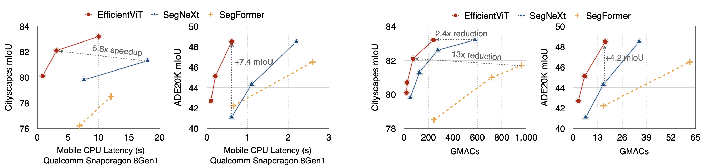

# EfficientViT

### [paper](https://arxiv.org/abs/2205.14756) | [poster](assets/efficientvit_files/poster.pdf)

## About EfficientViT Models

EfficientViT is a new family of vision models for efficient high-resolution vision, especially segmentation. The core building block of EfficientViT is a new lightweight multi-scale attention module that achieves global receptive field and multi-scale learning with only hardware-efficient operations. 

Here are comparisons with prior SOTA semantic segmentation models:
<p align="left">

</p>

Here are the results of EfficientViT on image classification:
<p align="left">

</p>

## Getting Started

### Installation
```bash
conda create -n efficientvit python=3.8.5
conda activate efficientvit
conda install pytorch=1.13.1 torchvision=0.14.1 pytorch-cuda=11.7 -c pytorch -c nvidia
pip install tqdm opencv-python
```

### Dataset
- ImageNet: https://www.image-net.org/
- Cityscapes: https://www.cityscapes-dataset.com/
- ADE20K: https://groups.csail.mit.edu/vision/datasets/ADE20K/

### Download Pretrained Models
Mobile latency is measured on Qualcomm Snapdragon 8Gen1 with Tensorflow-Lite, fp32, batch size 1.
#### ImageNet

| Model         |  Resolution | ImageNet Top1 Acc | ImageNet Top5 Acc |  Params |  MACs |  Mobile Latency | Checkpoint | 
|----------------------|:----------:|:----------:|:---------:|:------------:|:---------:|:------------:|:------------:|
| EfficientViT-B1 | 224 | 79.4 | 94.3 | 9.1M | 0.52G | 19ms | [link](https://drive.google.com/file/d/1hKN_hvLG4nmRzbfzKY7GlqwpR5uKpOOk/view?usp=share_link) |
| EfficientViT-B1 | 256 | 79.9 | 94.7 | 9.1M | 0.68G | 24ms | [link](https://drive.google.com/file/d/1hXcG_jB0ODMOESsSkzVye-58B4F3Cahs/view?usp=share_link) |
| EfficientViT-B1 | 288 | 80.4 | 95.0 | 9.1M | 0.86G | 31ms | [link](https://drive.google.com/file/d/1sE_Suz9gOOUO7o5r9eeAT4nKK8Hrbhsu/view?usp=share_link) |
| EfficientViT-B2 | 224 | 82.1 | 95.8 | 24M | 1.6G | 55ms | [link](https://drive.google.com/file/d/1DiM-iqVGTrq4te8mefHl3e1c12u4qR7d/view?usp=share_link) |
| EfficientViT-B2 | 256 | 82.7 | 96.1 | 24M | 2.1G | 72ms | [link](https://drive.google.com/file/d/192OOk4ISitwlyW979M-FSJ_fYMMW9HQz/view?usp=share_link) |
| EfficientViT-B2 | 288 | 83.1 | 96.3 | 24M | 2.6G | 92ms | [link](https://drive.google.com/file/d/1aodcepOyne667hvBAGpf9nDwmd5g0NpU/view?usp=share_link) |
| EfficientViT-B3 | 224 | 83.5 | 96.4 | 49M | 4.0G | 140ms | [link](https://drive.google.com/file/d/18RZDGLiY8KsyJ7LGic4mg1JHwd-a_ky6/view?usp=share_link) |
| EfficientViT-B3 | 256 | 83.8 | 96.5 | 49M | 5.2G | 180ms | [link](https://drive.google.com/file/d/1y1rnir4I0XiId-oTCcHhs7jqnrHGFi-g/view?usp=share_link) |
| EfficientViT-B3 | 288 | 84.2 | 96.7 | 49M | 6.5G | 228ms | [link](https://drive.google.com/file/d/1KfwbGtlyFgslNr4LIHERv6aCfkItEvRk/view?usp=share_link) |


#### Cityscapes

| Model         |  Resolution | Cityscapes mIoU | Params |  MACs |  Mobile Latency | Checkpoint | 
|----------------------|:----------:|:----------:|:---------:|:------------:|:---------:|:------------:|
|EfficientViT-B0 | 960x1920 | 75.5 | 0.7M | 3.9G | 0.20s | [link](https://drive.google.com/file/d/1AOe053EcLTpcW9hE7A7ENT5w2gIyYSWx/view?usp=share_link) |
| EfficientViT-B1 | 896x1792 | 80.1 | 4.8M | 19G | 0.82s | [link](https://drive.google.com/file/d/1GzDuKUrB1A-SVbpFuzInjf87BcBm6ypc/view?usp=share_link) |
| EfficientViT-B2 | 1024x2048 | 82.1 | 15M | 74G | 3.1s | [link](https://drive.google.com/file/d/11eSbiS55GYrXQVIhIzkIPUDQc_AgjeJA/view?usp=share_link) |
| EfficientViT-B3 | 1184x2368 | 83.2 | 40M | 240G | 10s | [link](https://drive.google.com/file/d/1aGtqBjZWTacWPLHjSXoH2GjM_KsM9SA2/view?usp=share_link) |

#### ADE20K

| Model         |  Resolution | ADE20K mIoU | Params |  MACs |  Mobile Latency | Checkpoint | 
|----------------------|:----------:|:----------:|:---------:|:------------:|:---------:|:------------:|
| EfficientViT-B1 | 480 | 42.7 | 4.8M | 2.7G | 0.10s | [link](https://drive.google.com/file/d/1_TIXoXkfoNkMwXgN___ejY8lqfDzCpqG/view?usp=share_link) |
| EfficientViT-B2 | 416 | 45.1 | 15M | 6.0G | 0.21s | [link](https://drive.google.com/file/d/1qFgjibkx2djSsMV-jx8oUqt8ODgCD-d4/view?usp=share_link) |
| EfficientViT-B3 | 512 | 49.0 | 39M | 22G | 0.8s | [link](https://drive.google.com/file/d/1SeRA1qG-fGGN8UrS1Widk-dzBh1TTINx/view?usp=share_link) |

## Usage

```python
from models.cls_model_zoo import create_cls_model

model = create_cls_model(
  name="b3", 
  pretrained=True, 
  weight_url="assets/checkpoints/cls/b3-r288.pt"
)
```

```python
from models.seg_model_zoo import create_seg_model

model = create_seg_model(
  name="b3", 
  dataset="cityscapes", 
  pretrained=True, 
  weight_url="assets/checkpoints/seg/cityscapes/b3-r1184.pt"
)
```

```python
from models.seg_model_zoo import create_seg_model

model = create_seg_model(
  name="b3", 
  dataset="ade20k", 
  pretrained=True, 
  weight_url="assets/checkpoints/seg/ade20k/b3-r512.pt"
)
```

## Evaluation
Please run `eval_cls_model.py` or `eval_seg_model.py` to evaluate our models. 

Examples: [classification](assets/efficientvit_files/eval_cls_model.sh), [segmentation](assets/efficientvit_files/eval_seg_model.sh)

## Visualization
Please run `eval_seg_model.py` to visualize the outputs of our semantic segmentation models. 

Example:
```bash
python eval_seg_model.py --dataset cityscapes --crop_size 1184 --model b3-r1184 --save_path demo/cityscapes/b3-r1184/
```

## Contact
Han Cai: hancai@mit.edu

## Citation
If EfficientViT is useful or relevant to your research, please kindly recognize our contributions by citing our paper:
```
@article{cai2022efficientvit,
  title={Efficientvit: Enhanced linear attention for high-resolution low-computation visual recognition},
  author={Cai, Han and Gan, Chuang and Han, Song},
  journal={arXiv preprint arXiv:2205.14756},
  year={2022}
}
```
