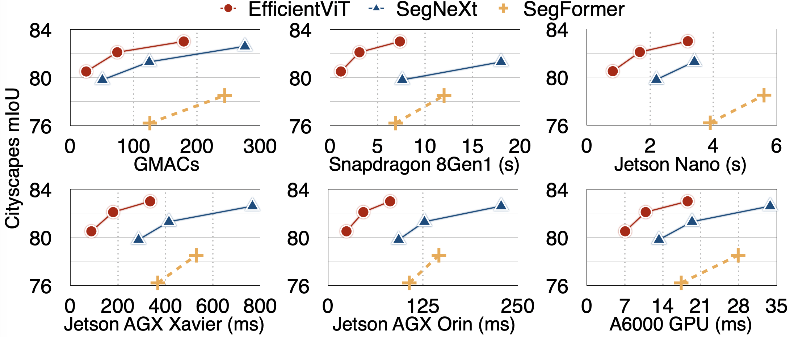
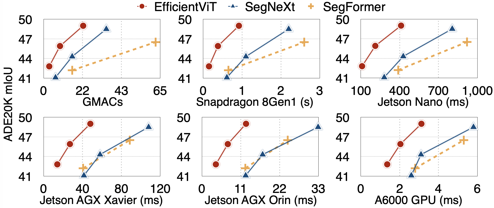

# Semantic Segmentation

## Datasets

<details>
  <summary>Cityscapes: https://www.cityscapes-dataset.com/</summary>

  ```python
  Our code expects the Cityscapes dataset directory to follow the following structure:

  cityscapes
  ├── gtFine
  |   ├── train
  |   ├── val
  ├── leftImg8bit
  |   ├── train
  |   ├── val
  ```

</details>

<details>
  <summary>ADE20K: https://groups.csail.mit.edu/vision/datasets/ADE20K/</summary>

  ```python
  Our code expects the ADE20K dataset directory to follow the following structure:

  ade20k
  ├── annotations
  |   ├── training
  |   ├── validation
  ├── images
  |   ├── training
  |   ├── validation
  ```
  
</details>

## Pretrained Models

Latency/Throughput is measured on NVIDIA Jetson Nano, NVIDIA Jetson AGX Orin, and NVIDIA A100 GPU with TensorRT, fp16. Data transfer time is included.

### Cityscapes

<p align="left">

</p>

| Model         |  Resolution | Cityscapes mIoU | Params |  MACs |  Jetson Orin Latency (bs1) | A100 Throughput (bs1) | Checkpoint |
|----------------------|:----------:|:----------:|:---------:|:------------:|:---------:|:---------:|:------------:|
| EfficientViT-L1 | 1024x2048 | 82.716 | 40M | 282G | 45.9ms  | 122 image/s | [link](https://drive.google.com/file/d/1iiy-LHpGIutXbPV-tJThAtz6jAgNcuxX/view?usp=sharing) |
| EfficientViT-L2 | 1024x2048 | 83.228 | 53M | 396G | 60.0ms  | 102 image/s | [link](https://drive.google.com/file/d/1U7Ryk0Iha8r00MK2hsYx88-PKJTmvSCR/view?usp=sharing) |

<details>
  <summary>EfficientViT B series</summary>

  | Model         |  Resolution | Cityscapes mIoU | Params |  MACs |  Jetson Nano (bs1) | Jetson Orin (bs1) | Checkpoint |
  |----------------------|:----------:|:----------:|:---------:|:------------:|:---------:|:---------:|:------------:|
  | EfficientViT-B0 | 1024x2048 | 75.653 | 0.7M | 4.4G | 275ms  | 9.9ms  | [link](https://drive.google.com/file/d/1Ix1Dh3xlpaf0Wzh01Xmo-hAYkoXt1EAD/view?usp=sharing) |
  | EfficientViT-B1 | 1024x2048 | 80.547 | 4.8M | 25G  | 819ms  | 24.3ms | [link](https://drive.google.com/file/d/1jNjLFtIUNvu5MwSupgFHLc-2kmFLiu67/view?usp=sharing) |
  | EfficientViT-B2 | 1024x2048 | 82.073 | 15M  | 74G  | 1676ms | 46.5ms | [link](https://drive.google.com/file/d/1bwGjzVQOg_ygML8F9JhsIj-ntn-cuWmB/view?usp=sharing) |
  | EfficientViT-B3 | 1024x2048 | 83.016 | 40M  | 179G | 3192ms | 81.8ms | [link](https://drive.google.com/file/d/19aiy3qrKqx1n8zzy_ewYn4-Z3LM4bkn4/view?usp=sharing) |

</details>

### ADE20K

<p align="left">

</p>

| Model         |  Resolution | ADE20K mIoU | Params |  MACs |  Jetson Orin Latency (bs1) | A100 Throughput (bs16) | Checkpoint |
|----------------------|:----------:|:----------:|:---------:|:------------:|:---------:|:---------:|:------------:|
| EfficientViT-L1 | 512x512 | 49.191 | 40M | 36G | 7.2ms  | 947 image/s | [link](https://drive.google.com/file/d/1ErosNnztXT3ncrppWWPEMp5pag5WE-Vy/view?usp=sharing) |
| EfficientViT-L2 | 512x512 | 50.702 | 51M | 45G | 9.0ms | 758 image/s | [link](https://drive.google.com/file/d/1UBEWNOqi6ks5h09Zoe6wWalUA8a2a7fi/view?usp=sharing) |

<details>
  <summary>EfficientViT B series</summary>

  | Model         |  Resolution | ADE20K mIoU | Params |  MACs |  Jetson Nano (bs1) | Jetson Orin (bs1) | Checkpoint |
  |----------------------|:----------:|:----------:|:---------:|:------------:|:---------:|:---------:|:------------:|
  | EfficientViT-B1 | 512x512 | 42.840 | 4.8M | 3.1G | 110ms | 4.0ms  | [link](https://drive.google.com/file/d/13YNtEJ-mRnAhu0fIs2EnAP-3TmSneRAC/view?usp=sharing) |
  | EfficientViT-B2 | 512x512 | 45.941 | 15M  | 9.1G | 212ms | 7.3ms  | [link](https://drive.google.com/file/d/1k5sWY6aJ1FCtMt4GRTZqSFlJ-u_TSHzc/view?usp=sharing) |
  | EfficientViT-B3 | 512x512 | 49.013 | 39M  | 22G  | 411ms | 12.5ms | [link](https://drive.google.com/file/d/1ghpTf9GTTj_8mn5QJh-7cLK1_wL3pKWr/view?usp=sharing) |

</details>

## Usage

```python
# semantic segmentation
from efficientvit.seg_model_zoo import create_seg_model

model = create_seg_model(
  name="l2", dataset="cityscapes", weight_url="assets/checkpoints/seg/cityscapes/l2.pt"
)

model = create_seg_model(
  name="l2", dataset="ade20k", weight_url="assets/checkpoints/seg/ade20k/l2.pt"
)
```

## Evaluation

Please run `eval_seg_model.py` to evaluate our models.

Examples: [segmentation](../assets/files/eval_seg_model.sh)

## Visualization

Please run `eval_seg_model.py` to visualize the outputs of our semantic segmentation models.

Example:

```bash
python eval_seg_model.py --dataset cityscapes --crop_size 1024 --model b3 --save_path demo/cityscapes/b3/
```

## Export

### Onnx

To generate ONNX files, please refer to `onnx_export.py`.

### TFLite

To generate TFLite files, please refer to `tflite_export.py`. It requires the TinyNN package.

```bash
pip install git+https://github.com/alibaba/TinyNeuralNetwork.git
```

Example:

```bash
python tflite_export.py --export_path model.tflite --task seg --dataset ade20k --model b3 --resolution 512 512
```

## Citation

If EfficientViT is useful or relevant to your research, please kindly recognize our contributions by citing our paper:

```
@article{cai2022efficientvit,
  title={Efficientvit: Enhanced linear attention for high-resolution low-computation visual recognition},
  author={Cai, Han and Gan, Chuang and Han, Song},
  journal={arXiv preprint arXiv:2205.14756},
  year={2022}
}
```
